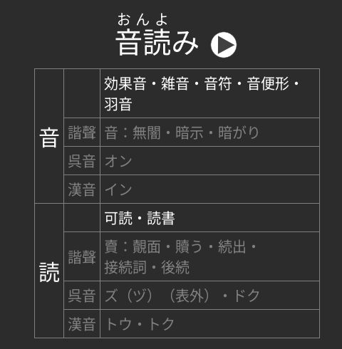
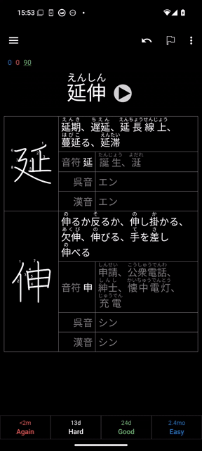
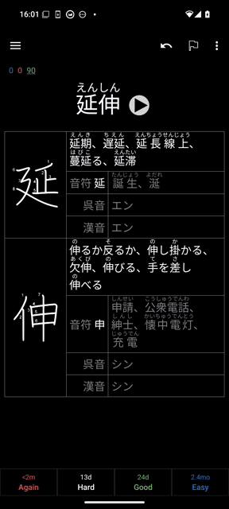
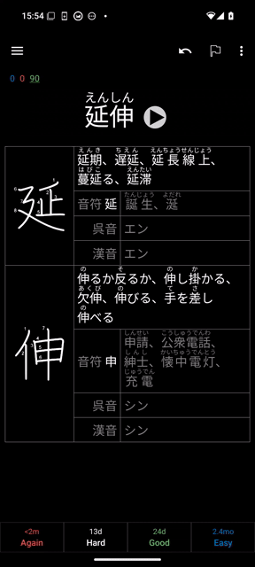

# Hanzi Web for Anki


This addon generates a "web" of hanzi/kanji amongst your Anki notes, adding a
few examples taken from cards you've already reviewed for each hanzi in each
note. The intent is that you'll be able to more easily learn the readings of
hanzi if you are reminded of other words it comprises that you've already
studied.

As of version 1.2.0, Hanzi Web can be configured such that clicking on hanzi or
terms can open dictionary apps, webpages, the Anki browser or note editor, etc.
As of version 1.3.0, multiple actions can be specified in a context menu. GIFs
can explain better than words can:

Showing all notes which contain the same hanzi...



Viewing a term in Yomichan via
[Textbender](https://github.com/elizagamedev/android-textbender)...



Viewing a phonetic component (音符) in [Pleco](https://www.pleco.com/)...



Please read the full readme and [config.md](config.md) for more details.

## Installation
You may install this from its [Anki Web
page](https://ankiweb.net/shared/info/125468335). You may alternatively download
it from the GitHub releases page, then install in Anki via `Tools -> Add-ons ->
Install from file…`

## Configuration
**Note that Hanzi Web has changed significantly from v0.1.2 to v1.0.0.** If you
are getting nagged that your config is out of date, please re-read this section
and then update your `config_version` to `1`.

You can configure Hanzi Web through Anki after installing via `Tools -> Add-ons
-> Hanzi Web -> Config`. See [config.md](config.md).

You may want to also configure the CSS of your notes, as Hanzi Web does no
styling by default. It instead exposes the following CSS classes:

- `.hanziweb`, applied to the whole `<table>`.
- `.hanziweb-hanzi`, which is the hanzi for which terms are listed (the left
  side of the screenshot shown above).
- `.hanziweb-kind`, which is applied to the left `<td>`s which denote the "kind"
  of row: terms with exact hanzi matches, terms with phonetic series matches, or
  on'yomi readings.
- `.hanziweb-terms`, which is applied to the right `<td>`s which list terms (or
  onyomi).
- `.hanziweb-same`, `.hanziweb-phonetic-series`, and `.hanziweb-onyomi`, which
  can be used to style entire rows based on their "kind".
- `.hanziweb-phonetic-component`, which is the the phonetic component character
  (音符).

Similar styling to the above screenshot was achieved with the following CSS. You
may copy it into your note type's CSS if you wish.

``` css
.hanziweb {
  margin: 10px auto;
  max-width: 500px;
  border-style: solid;
  border-color: gray;
  border-width: 1px;
  border-collapse: collapse;
}

.hanziweb a {
  color: unset;
  text-decoration: unset;
}

.hanziweb td {
  border-style: solid;
  border-color: gray;
  border-width: 1px;
  padding: 5px;
}

.hanziweb-hanzi {
  font-family: IPAMincho, serif;
  text-align: center;
  font-size: 30px;
  margin: 5px;
}

.hanziweb-kind {
  font-size: 20px;
  text-align: right;
  white-space: nowrap;
}

.hanziweb-terms {
  font-size: 20px;
  text-align: left;
  word-break: keep-all;
  width: 100%;
  overflow-wrap: anywhere;
}

.hanziweb-phonetic-series,
.hanziweb-onyomi {
  color: gray;
}

.hanziweb-phonetic-component {
  color: black;
}

.nightMode .hanziweb-phonetic-component {
  color: white;
}
```

You can specify `display: none;` on `.hanziweb-phonetic-series` or
`.hanziweb-onyomi` if you don't wish to see either. For example, to disable
displaying on'yomi:

```css
.hanziweb-onyomi {
  display: none;
}
```

### Chinese notes vs. Japanese notes

Notes can be configured to be recognized as either Chinese or Japanese by
adjusting the `japanese_search_query` option. There are subtle differences to
each.

### Chinese

- Characters are used as-is to look up phonetic series. In the future,
  simplified characters will be converted to traditional characters.
- Japanese on'yomi readings are omitted.

### Japanese

- On'yomi are included in entries, and further differentiated into go'on,
  kan'on, etc. This data is derived from [MarvNC's Wiktionary Yomichan
  dictionary](https://github.com/MarvNC/yomichan-dictionaries#wiktionary-kanji),
  which in turn is derived from Wiktionary. There may be errors from parsing or
  from incorrect source information.
- When looking up the phonetic series, shinjitai characters will be converted to
  kyūjitai. This is done because the included database of phonetic series is
  based on traditional Chinese, which more closely matches kyūjitai variants.
  Regardless, there is not perfect coverage of Japanese.
- If both a `hanzi_fields_regexp` field and a `kyujitai_field` field are found
  on a note, there will be a *one way conversion* from shinjitai to kyūjitai on
  the matched notes. The results are not perfect. The intent is not necessary
  for users to study the kyūjitai forms (this is probably not generally helpful
  when learning Japanese), but rather to be able to have broader coverage when
  looking up Japanese words in Chinese dictionaries, for example, the [Outlier
  Dictionary of Chinese Characters](https://www.outlier-linguistics.com/products/outlier-dictionary-of-chinese-characters) in Pleco.

## Usage
Ensure that the note types of the notes you want to add web entries to have a
field called "HanziWeb" (without quotes). Also ensure that you've configured
Hanzi Web as described in the [Configuration](#configuration) section, so that
you are including the correct cards and using the hanzi from the correct fields.
Make sure that you add `{{HanziWeb}}` to your cards' HTML templates as well. If
your terms contain Ruby text, you can specify `{{furigana:Hanziweb}}` instead.
See [Anki documentation on ruby
characters](https://docs.ankiweb.net/templates/fields.html?highlight=furigana#ruby-characters)
for more information.

Now you can add web entries to your notes by accessing `Tools -> Hanzi Web ->
Update notes…` or by pressing `Control-W` (`Command-W` on macOS). A dialog with
a report of the pending changes will be shown; you'll want to consider this
carefully if it's your first time running Hanzi Web or if you've recently
changed your configuration to make sure that you haven't made any mistakes.
Click "Apply" and your notes' "HanziWeb" fields will be filled!

Alternatively, you can set `auto_run_on_sync` to `true` to automatically run
Hanzi Web before and after each sync operation.

## Copyright
This addon uses data from Wiktionary for both the phonetic series and on'yomi.
Please view Wiktionary's copyright information
[here](https://en.wiktionary.org/wiki/Wiktionary:Copyrights).
