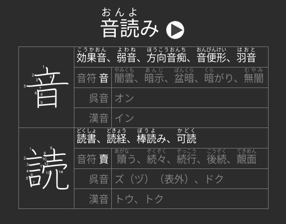

# Hanzi Web for Anki


This addon generates a “web” of hanzi/kanji amongst your Anki notes, adding a
few examples taken from cards you’ve already reviewed for each hanzi in each
note. The intent is that you’ll be able to more easily learn the readings of
hanzi if you are reminded of other words it comprises that you’ve already
studied.

## Installation
This addon is not available on AnkiWeb as of right now; please download it from
the releases tab, then install in Anki via `Tools -> Add-ons -> Install from
file…`

## Configuration
You can configure Hanzi Web through Anki after installing via `Tools -> Add-ons
-> Hanzi Web -> Config`. See [config.md](config.md).

You may want to also configure the CSS of your notes, as Hanzi Web does no
styling by default. It instead exposes three CSS classes:

- `ol.hanziewb`, applied to the `<ol>` which contains each entry.
- `span.hanziweb-hanzi`, which is the hanzi for which terms are listed (the left
  side of the screenshot shown above).
- `span.hanziweb-terms`, which contains the entire list of terms (the right side
  of the screenshot shown above).

The styling in the above screenshot was achieved with the following CSS. You may
copy it into your note type’s CSS if you wish.

``` css
ol.hanziweb {
  list-style-type: none;
  margin: 10px auto;
  font-size: 20px;
  max-width: 400px;
  border-style: solid;
  border-color: gray;
  border-width: 1px;
  padding: 5px 10px 5px 10px;
}

.hanziweb-hanzi {
  font-weight: bold;
  margin-right: 20px;
  font-size: 30px;
  font-family: serif;
}
```
